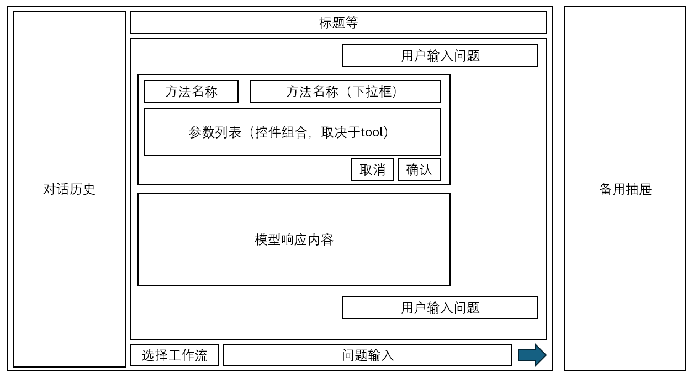

# 整体方案

应用分为3部分：
1. IPS日志分析
2. IPS设置（引导？）
3. 知识库问答

## 项目架构

llamacpp ---> langchain ---> langgraph ---> fastapi ---> react/C# WPF

- llamacpp: 模型部署
- langchain+langgraph: 智能体构建
- fastapi+界面: api和前端应用部分

大致的界面：



其中备用抽屉部分默认隐藏，可放入知识库查询后的直接预览信息或当前agent挂载的tools信息

## 应用流程

1. 选择应用部分以及llm模型（根据不同的应用加载对应的agent）

### IPS分析部分

2. 用户输入问题
3. 调用agent(chat接口)
4. 若涉及工具调用，则需要进行用户确认或修改后调用(resume接口)
5. 返回结果

### 知识库问答

2. 用户输入问题
3. 调用agent(chat接口)
4. 查询知识库进行知识汇总
5. 返回结果

### IPS设置（引导？）

2. 用户输入问题
3. 调用agent(chat接口)
4. 查询知识库进行知识汇总后，引导用户可设置哪些部位，提示用户输入更改指令(可选)
5. 模型请求调用IPS点位设置进入interrupt，提示用户确认或者修改(resume)
6. 调用IPS点位设置方法（BTS WebAPI）
5. 返回结果

## 应用接口

服务对每个agent提供两个对应的接口，分别为**chat**和**resume**

- /chat: 处理用户的问题输入，当需要用户确认流程时，返回interrupt
- /resume: 当用户处理完interrupt，调用该接口继续agent处理流程

### /ips/chat

- 请求方法: POST
- body: 
```json
{
  "thread_id": "string", 可选输入，若不传则系统自动生成
  "message": "string" 用户问题输入
}
```
- 响应：
```json
{
  "thread_id": "string", agent线程id，用于继续agent处理流程
  "response": "string", 回答结果
  "interrupt": {
    "additionalProp1": {} 若interrupt不为null，则代表agent进入了interrupt流程，需要用户确认操作或者更改操作
  }
}
```

### /ips/resume

- 请求方法: POST
- body:
```json
{
  "thread_id": "string", 在chat接口返回结果中拿到的线程id，需要对应
  "approved": true, 用户是否确认操作
  "modified_args": {
    "additionalProp1": {} 用户修改的操作表单
  }
}
```
- 响应：
```json
{
  "thread_id": "string", agent线程id，用于继续agent处理流程
  "response": "string", 回答结果
  "interrupt": {
    "additionalProp1": {} 若interrupt的大括号中有数据，则代表agent进入了interrupt流程，需要用户确认操作或者更改操作
  }
}
```
相当于存在 **chat->resume->chat->resume->...** 的处理流程，取决于agent的模式

### /ips/tool/list

- 请求方法: GET
- 参数
- 响应
```json
{
  "tools": [
    {
        "name": "placeholder",
        "args": {
            
        }
    },
    ...
  ]
}
```


### /rag

- 请求方法: POST
- body:
```json
{
  "message": "string" 用户问题输入
}
```
- 响应：
```json
{
  "response": "string", 回答结果
}
```